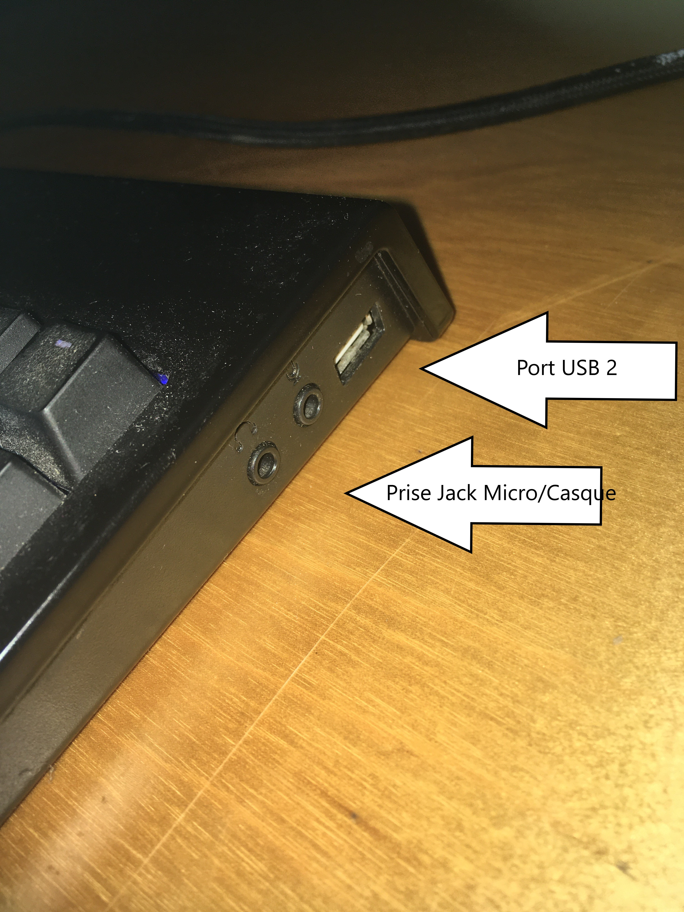

Exercice : Connectiques et composants d’un ordinateur portable
1. Photographier toutes les connectiques de l’ordinateur
Voici les différentes connectiques que l’on peut trouver sur le laptop. Les photos seront à insérer à cet endroit.

2. Description des connectiques

- Port USB-A : permet de connecter des périphériques classiques (clavier, souris, clé USB, etc.).
- Ports (Jack)audio 3.5 mm : entrée microphone et sortie casque.
- Port Ethernet RJ45 : utilisé pour la connexion filaire à un réseau local.
- Ports HDMI : permettent de connecter un ou plusieurs écrans externes.
- Port USB4 (Type-C) : utilisé pour la charge rapide, le transfert de données à haute vitesse et la connexion d’écrans ou stations d’accueil.
- Port d’alimentation : utilisé pour brancher le chargeur secteur.
3. Description des composants internes
Sur la photo du laptop ouvert, on peut observer les principaux composants :
- Ventilateurs et caloducs : assurent le refroidissement du processeur (CPU) et de la carte graphique (GPU).
- Modules de RAM (SO-DIMM) : mémoire vive permettant le traitement rapide des données.
- SSD M.2 : disque de stockage principal du système d’exploitation et des fichiers.
- Batterie Li-ion : source d’alimentation interne de l’ordinateur.
- Carte mère : relie et alimente tous les composants internes.
- Connecteurs Wi-Fi et antennes : pour la connectivité sans fil.
