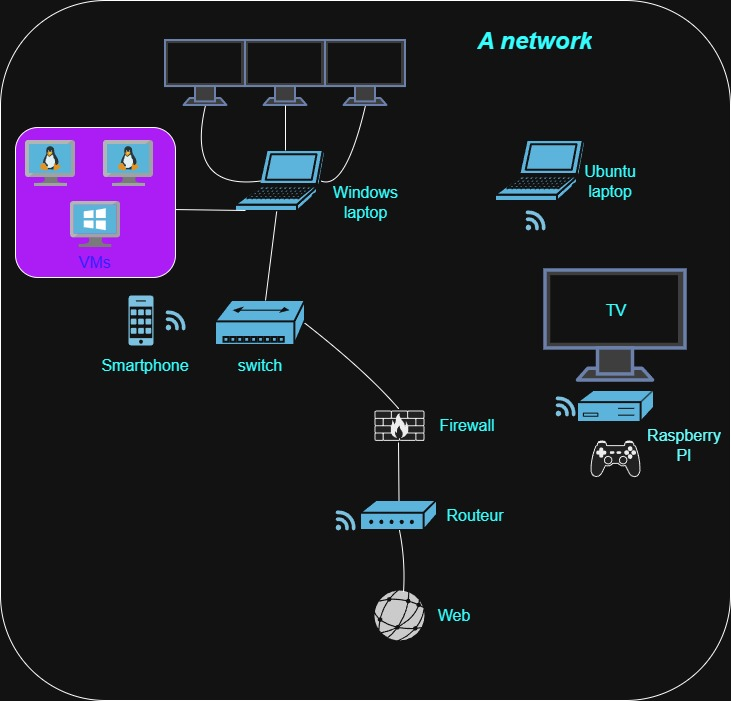

# 🖧 Réseau domestique

Ce document présente le schéma d'un réseau informatique personnel, réalisé dans le cadre du challenge **Réseau – Introduction** de la formation O’Clock (Aldébaran – Administrateur Systèmes & Cybersécurité).

---

## 📘 Schéma du réseau

---

## 🧩 Description du synoptique

Le schéma ci-dessus illustre la topologie de mon réseau à domicile.  
Il se compose des éléments suivants :

### 🔹 Routeur et pare-feu
- Le **routeur** assure la connexion à Internet (via la box du FAI).  
- Un **pare-feu** (firewall) protège le réseau interne et filtre le trafic entrant et sortant.

### 🔹 Commutateur (Switch)
- Le **switch** relie plusieurs appareils du réseau local filaire.  
- Il permet notamment de connecter mon **ordinateur portable Windows** ainsi que les **machines virtuelles (VMs)**.

### 🔹 Postes clients
- **Windows laptop** : poste principal de travail, connecté au switch.  
- **Machines virtuelles (VMs)** : plusieurs systèmes installés (Windows et Linux).  
- **Ubuntu laptop** : machine secondaire connectée en Wi-Fi.  
- **Smartphone** : appareil mobile relié au réseau via Wi-Fi.

### 🔹 Serveur et multimédia
- **Raspberry Pi** : mini-serveur pour le stockage, le multimédia ou la supervision.  
- **TV** : connectée au Raspberry Pi pour l’affichage.  
- **Manette de jeu** : associée au Raspberry Pi pour le divertissement.

### 🔹 Connexion Internet
- Le réseau local (LAN) est relié au **Web** via le routeur.  
- Tous les périphériques filaires et sans fil accèdent à Internet à travers cette passerelle commune.

---

## 🧠 Objectif pédagogique

Ce synoptique permet de :
- Visualiser la structure logique d'un réseau domestique.  
- Comprendre le rôle et la hiérarchie des différents composants.  
- Servir de base pour les prochains exercices de configuration ou de sécurisation réseau.

---

*Réalisé par **Julien Grange** — Formation O’Clock, parcours Administrateur Systèmes & Cybersécurité.*
