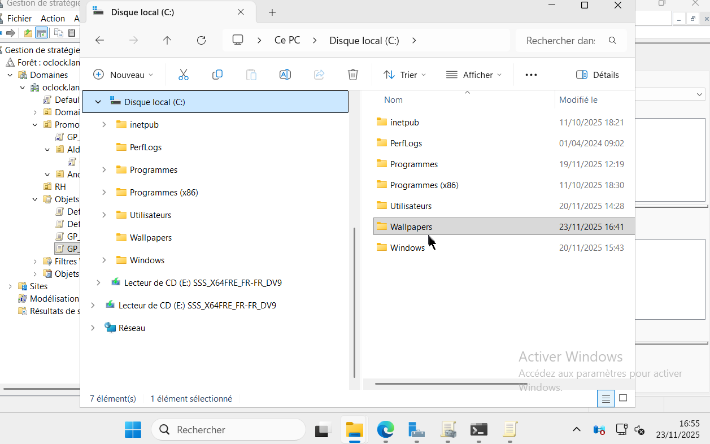
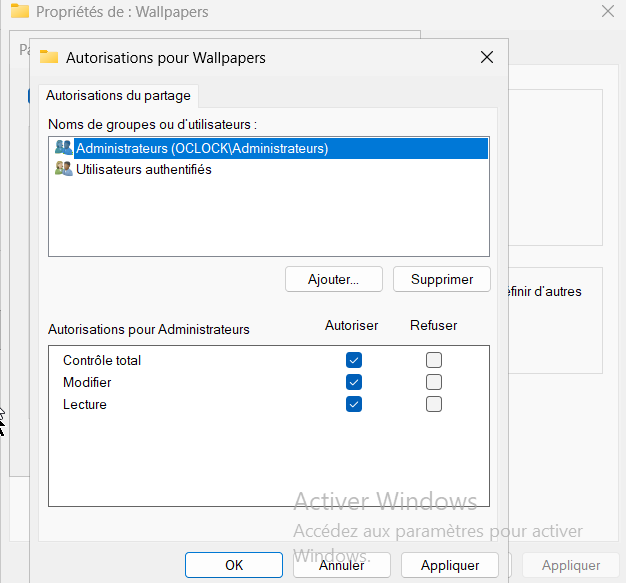

## ⌨️ Challenge

We are working on a **Windows Server 2025** machine hosted on a Proxmox server.

Topics covered:

* Active Directory
* Creating users and Organizational Units
* Implementing GPOs
* Difference between User GPOs and Computer GPOs
* GPUpdate
* Refresh intervals

Update the Active Directory structure with the following information (the **RH** OU can be deleted):

```
Oclock.lan
└── Promotions (OU)
    ├── Patrice (User)
    ├── Andromede (OU)
    │     ├── Baptiste Delphin (User)
    │     └── GS_PromoAndromede (Group)
    └── Aldebaran (OU)
          ├── Charles Hoffmann (User)
          └── GS_PromoAldebaran (Group)
```

Set up a GPO for user wallpapers:

* Prevent users from changing the wallpaper
* Enforce a specific wallpaper

The `gpupdate /force` command may be useful.

You can also test the GPO on one OU but not on the other.

---

# Windows 10 Client Machine

The client machine is a Windows 10 computer on the same LAN.

Create a folder in **C:** that will contain the wallpaper image.



Place the wallpaper image inside this folder (preferably in `.jpg` format).

---

# Sharing Permissions

Configure the following permissions:

* **Authenticated Users → Read**
* **Administrators → Full Control**


---

# NTFS Permissions (Security Tab)

Repeat the same configuration under **Security**:


---

# Setting the Wallpaper in the GPO

We will apply the file `liminal.jpg` as the wallpaper for users in both Promotions OUs.


---

# Linking the GPO

Enable the rule, enter the UNC path, and link the GPO to the **Promotions** OU:


---

# Result

The wallpaper will be applied at the next login for any user belonging to the *Promotions* domain structure.



---

# Adding a User to the Promotions OU


---

# Useful Command

Force immediate GPO application:

```
gpupdate /force
```

---


