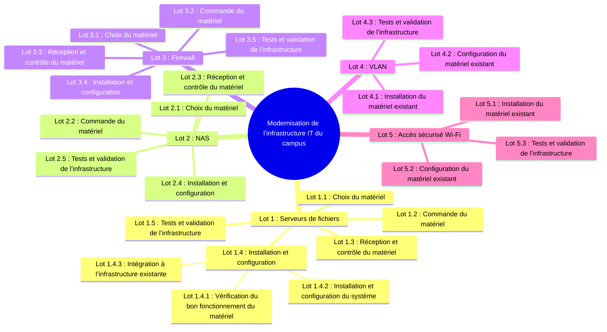
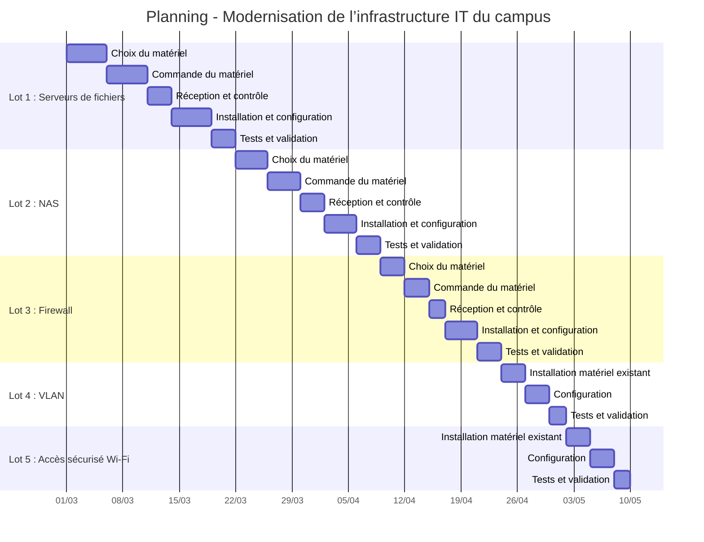

# 📘 Modernisation de l’infrastructure IT du campus

## Work Breakdown Structure (WBS)

---

## 🎯 Objectif du projet

L’objectif de ce projet est de moderniser l’infrastructure informatique du campus afin de permettre le déploiement de nouveaux services numériques (serveurs de fichiers, NAS, firewall, VLAN, Wi-Fi sécurisé), tout en garantissant :

* la continuité pédagogique,
* la sécurité des accès,
* le respect des bonnes pratiques IT.

---

## 🧱 Découpage du projet (WBS)

Le **Work Breakdown Structure (WBS)** ci-dessous présente une décomposition hiérarchique du projet.
Il permet d’identifier clairement les lots, les tâches associées et, lorsque nécessaire, les sous-tâches.

> 🔎 **Lecture du WBS**
>
> * Niveau 1 : Lots du projet
> * Niveau 2 : Tâches
> * Niveau 3 : Sous-tâches (le cas échéant)

---

## 📊 Représentation graphique du WBS

## 📦 Lots, objectifs et livrables

| Lot | Intitulé | Objectif principal | Livrables attendus |
|----|---------|-------------------|-------------------|
| Lot 1 | Serveurs de fichiers | Mettre à disposition un service de stockage centralisé et accessible aux utilisateurs | Serveurs de fichiers installés, configurés et testés |
| Lot 2 | NAS | Fournir une solution de stockage mutualisée et sécurisée | NAS opérationnel et intégré à l’infrastructure |
| Lot 3 | Firewall | Sécuriser les flux entrants et sortants du réseau | Firewall installé, configuré et validé |
| Lot 4 | VLAN | Segmenter le réseau afin d’isoler les usages et renforcer la sécurité | VLAN fonctionnels et testés |
| Lot 5 | Accès sécurisé Wi-Fi | Offrir un accès sans fil sécurisé aux utilisateurs | Réseau Wi-Fi sécurisé et validé |

---

## 🗓️ Planning prévisionnel du projet

---
