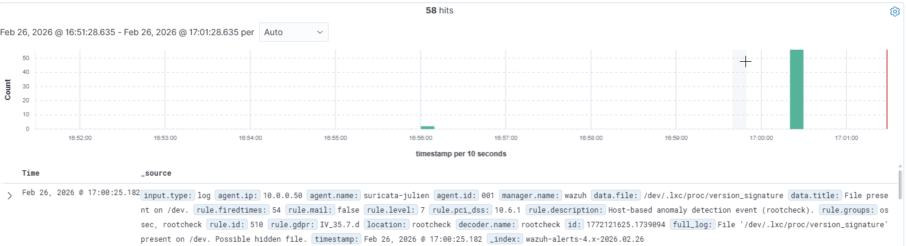

# Atelier — IDS/IPS & SIEM (Suricata + Wazuh) — Lab Proxmox

## Contexte
- Hyperviseur : Proxmox
- Réseau LAN : vmbr2 — 10.0.0.0/16
- Gateway/Firewall : pfSense — 10.0.0.1
- Client : Windows — 10.0.0.10
- IDS/IPS : Suricata — 10.0.0.50
- SIEM : Wazuh (All-in-one) — 10.0.0.40

## Objectif
Mettre en place une chaîne SOC : **détection (Suricata)** → **collecte (Wazuh agent)** → **corrélation/visualisation (Wazuh Dashboard)**.

---

# Étape 0 — Pré-check infra & capacité
## Actions
- ✅ OK Vérifier RAM dispo (>= 10 Go sur l’hôte Proxmox)
- ✅ OK Vérifier vmbr2 opérationnel + routage/NAT via pfSense
- ✅ OK Valider DNS/Internet sortant depuis le LAN

## Preuves (captures)

Depuis Suricata :

✅ ping 10.0.0.1 → OK
✅ ping 8.8.8.8 → OK

- ✅ OK Proxmox: résumé ressources (RAM)
- ✅ OKpfSense: règles LAN/NAT (si nécessaire)
- ✅ OK Ping gateway + 8.8.8.8 depuis une VM LAN

## Résultat
- ✅ OK / ❌ NOK
- Notes:

---

# Étape 1 — Déployer Suricata (CT/VM) + config IDS

## Étape 1.1 : Un IDS/IPS c'est quoi ?
Un IDS (Intrusion Detection System) surveille le trafic réseau et génère des alertes quand il détecte un comportement suspect. Un IPS (Intrusion Prevention System) fait la même chose, mais peut en plus bloquer le trafic malveillant.

## Étape 1.2 : Créer la machine Suricata sur un conteneur LXC de notre lab Proxmox

## Actions
- ✅ OK Créer CT/VM sur vmbr2 avec IP statique 10.0.0.50/16 gw 10.0.0.1

## Étape 1.3 : Vérifier la connectivité — Suricata (10.0.0.50)

### Tests effectués

- Ping Gateway (pfSense — 10.0.0.1)

Résultat : ✅ Succès  
Latence faible (~0.3 ms) → communication LAN fonctionnelle.

- Ping Internet (8.8.8.8)

Résultat : ✅ Succès  
Aucune perte → NAT pfSense opérationnel.

### Conclusion

La machine Suricata dispose :

✅ Connectivité LAN  
✅ Accès Internet  
✅ Routage correct via pfSense

Environnement réseau validé.

## Étape 1.4 : Installer Suricata

`apt update && apt upgrade -y
 apt install -y suricata suricata-update`

`root@suricata-julien:~# suricata --build-info | head -5
This is Suricata version 7.0.10 RELEASE
Features: NFQ PCAP_SET_BUFF AF_PACKET HAVE_PACKET_FANOUT LIBCAP_NG LIBNET1.1 HAVE_HTP_URI_NORMALIZE_HOOK PCRE_JIT HAVE_NSS HTTP2_DECOMPRESSION HAVE_LUA HAVE_JA3 HAVE_JA4 HAVE_LUAJIT HAVE_LIBJANSSON TLS TLS_C11 MAGIC RUST POPCNT64
SIMD support: SSE_4_2 SSE_4_1 SSE_3 SSE_2
Atomic intrinsics: 1 2 4 8 16 byte(s)
64-bits, Little-endian architecture`

## Étape 1.5 : Configurer Suricata

### Paramètres ajustés

- HOME_NET défini sur 10.0.0.0/16
- Interface capture : eth0 (AF_PACKET)
- Logs EVE JSON enrichis activés :
  - payload
  - payload-printable
  - packet
  - tagged-packets

### Validation

Commande exécutée :

suricata -T -c /etc/suricata/suricata.yaml

Résultat :

✅ Configuration chargée avec succès

### Conclusion

Configuration IDS conforme pour détection + intégration SIEM.

## Étape 1.6 : Télécharger les règles

`suricata-update`\
`grep -c "^alert" /var/lib/suricata/rules/suricata.rules`\
`48775`

## Étape 1.7 : Démarrer Suricata

`systemctl enable suricata`\
`systemctl start suricata`\
`systemctl status suricata`

## Validation Suricata — Chargement des règles

### Incident observé
Log initial :

"1 rule files specified, but no rules were loaded"

### Analyse
Le moteur Suricata était actif mais aucune règle n’était chargée.

Impact : IDS aveugle (aucune détection possible).

### Action corrective
- Arrêt du service Suricata
- Nettoyage complet du répertoire `/var/lib/suricata/rules`
- Reconstruction du ruleset via `suricata-update`
- Redémarrage du moteur

### Validation
Log Suricata :

"48776 rules successfully loaded"

`root@suricata-julien:~# suricata -T -c /etc/suricata/suricata.yaml`\
`i: suricata: This is Suricata version 7.0.10 RELEASE running in SYSTEM mode`\
`i: suricata: Configuration provided was successfully loaded. Exiting.`\

### Conclusion
Le moteur IDS charge correctement le jeu de signatures.
Suricata pleinement opérationnel.

# Étape 2 : Générer un événement de test

## Étape 2.1 : Déclencher une règle connue

`alert ip any any -> any any (msg:"GPL ATTACK_RESPONSE id check returned root"; content:"uid=0|28|root|29|"; classtype:bad-unknown; sid:2100498; rev:7;)`

## Étape 2.2 : Vérifier l'alerte dans les logs

`cat /var/log/suricata/fast.log`\
`cat /var/log/suricata/fast.log
02/26/2026-12:41:48.218175  [**] [1:2100498:7] GPL ATTACK_RESPONSE id check returned root [**] [Classification: Potentially Bad Traffic] [Priority: 2] {TCP} 18.239.36.127:80 -> 10.0.0.50:33518`

Il a détecté le contenu uid=0(root) dans la réponse HTTP et a déclenché la règle correspondante.

# Étape 3 : Installer Wazuh (SIEM)

## Étape 3.1 : Un SIEM c'est quoi ?
Un SIEM (Security Information and Event Management) est une plateforme qui collecte les logs de multiples sources (IDS, pare-feu, serveurs...), les normalise, les corrèle pour détecter des attaques, et alerte les analystes via un tableau de bord centralisé.

       Sources                          SIEM Wazuh
    ┌──────────┐                   ┌──────────────────┐
    │ Suricata │──── eve.json ────>│  Wazuh Manager   │
    │  (IDS)   │   via agent       │        │         │
    └──────────┘                   │        ▼         │
                                   │  Wazuh Indexer   │
    ┌──────────┐                   │        │         │
    │  Win11   │──── syslog ──────>│        ▼         │
    │ (cible)  │   via agent       │ Wazuh Dashboard  │
    └──────────┘                   └──────────────────┘

## Étape 3.2 : Créer la VM Wazuh

| Onglet   | Champ   | Valeur                          |
|----------|---------|----------------------------------|
| Général  | VM ID   | 401 (ou autre libre)            |
| Général  | Nom     | Wazuh                           |
| OS       | ISO Image | debian-13 (ou ubuntu-24.04 server) |
| Système  | Type    | Linux                            |
| Disque   | Taille  | 50 Go                            |
| CPU      | Cœurs   | 2 (idéalement 4)                 |
| Mémoire  | RAM     | 8192 Mo (8 Go)                   |
| Réseau   | Bridge  | vmbr2                            |
| Réseau   | Modèle  | VirtIO                           |

## Étape 3.3 : Configurer le réseau

ping 10.0.0.1       # Gateway
ping 10.0.0.50      # Suricata
ping 8.8.8.8        # Internet

Résultat : ✅ Succès  

## Étape 3.4 : Installer Wazuh (tout-en-un)

`su -`\
`curl -sO https://packages.wazuh.com/4.14/wazuh-install.sh`\
`sudo bash ./wazuh-install.sh -a`\

Récupération de l'idenditiant et du password

## Étape 3.5 : Vérifier les services

`systemctl status wazuh-manager`\
`systemctl status wazuh-indexer`\
`systemctl status wazuh-dashboard`\

Résultat : Les trois services sont actifs ✅

# Étape 4 : Connecter les sources

## Étape 4.1 : Installer l'agent Wazuh sur Suricata

Côté serveur Suricata : 

`systemctl daemon-reload`\
`systemctl enable wazuh-agent`\
`systemctl start wazuh-agent`\
`systemctl status wazuh-agent`\

Résultat : L'agent est actif ✅

## Étape 4.2 : Vérifier la connexion de l'agent

Côté serveur Wazuh : 

`/var/ossec/bin/manage_agents -l`\
`Available agents:
   ID: 001, Name: suricata-julien, IP: any`\

Résultat : L'agent Suricata est actif ✅

## Étape 4.3 : Configurer la collecte des logs Suricata

Par défaut, l'agent Wazuh collecte les logs système (auth.log, syslog…). Il faut lui dire de lire aussi le fichier eve.json de Suricata.

Sur la machine Suricata, on édite la configuration de l'agent dans et on effectue un restart de l'agent : 

nano /var/ossec/etc/ossec.conf

## Étape 4.4 : Vérifier la réception des événements

La capture montre la bonne réception de l'évenement. 

## Preuves (captures)

- [ ] Extrait `suricata.yaml` (HOME_NET, af-packet, eve-log alert)
- [ ] `grep -c "^alert" ...suricata.rules`
- [ ] `systemctl status suricata` + log “all AFP capture threads are running”

## Résultat
- ✅ OK / ❌ NOK
- Notes:

---

# Étape 2 — Générer un événement Suricata (test de règle)
## Actions
- [ ] `curl http://testmynids.org/uid/index.html`
- [ ] Vérifier alerte dans `eve.json` + `fast.log`

## Preuves (captures)
- [ ] sortie curl
- [ ] `jq 'select(.event_type=="alert")'` (1 alerte minimum)
- [ ] `tail` de `fast.log`

## Résultat
- ✅ OK / ❌ NOK
- Notes:

---

# Étape 3 — Déployer Wazuh (All-in-one)
## Actions
- [ ] Créer VM 10.0.0.40/16 (8 Go RAM mini, 50 Go disk)
- [ ] Installer Wazuh via script `wazuh-install.sh -a`
- [ ] Valider services (manager/indexer/dashboard)
- [ ] Accéder au dashboard https://10.0.0.40

## Preuves (captures)
- [ ] `systemctl status wazuh-*`
- [ ] écran login dashboard + menu latéral
- [ ] récupération credentials install

## Résultat
- ✅ OK / ❌ NOK
- Notes:

---

# Étape 4 — Connecter Suricata -> Wazuh (agent + collecte eve.json)
## Actions
- [ ] Installer wazuh-agent sur Suricata (manager=10.0.0.40)
- [ ] Enregistrer/valider agent “Active”
- [ ] Ajouter `<localfile>` sur `/var/log/suricata/eve.json` (json)
- [ ] Vérifier réception dans Discover (agent.name: Suricata)

## Preuves (captures)
- [ ] `manage_agents -l` côté manager
- [ ] capture dashboard Agents “Active”
- [ ] extrait `ossec.conf` localfile
- [ ] Discover avec événements Suricata

## Résultat
- ✅ OK / ❌ NOK
- Notes:

---

# Étape 5 — Validation end-to-end (détection visible dans Wazuh)
## Actions
- [ ] Rejouer test `curl testmynids`
- [ ] Filtrer Wazuh : `rule.groups: suricata` ou `data.alert.signature_id: 2100498`

## Preuves (captures)
- [ ] `fast.log` / `eve.json`
- [ ] Discover avec SID 2100498

## Résultat
- ✅ OK / ❌ NOK
- Notes:

---

# Bonus — Règle Suricata custom + remontée Wazuh
## Actions
- [ ] `local.rules` avec SID 1000001
- [ ] Charger `local.rules` dans `suricata.yaml`
- [ ] Déclencher via curl/netcat
- [ ] Vérifier dans Wazuh (SID 1000001)

## Preuves (captures)
- [ ] contenu `local.rules`
- [ ] `jq` sur eve.json (SID 1000001)
- [ ] Discover SID 1000001

## Résultat
- ✅ OK / ❌ NOK
- Notes:
