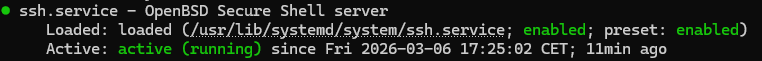
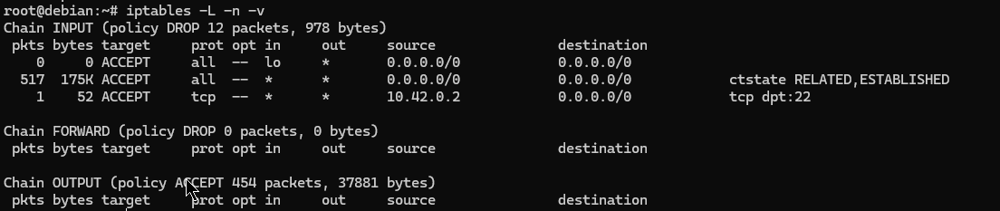
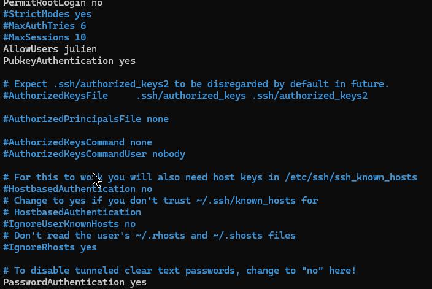
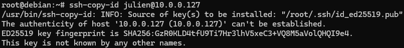

# Sécurisation d’un serveur Debian exposé sur Internet

## Contexte

Dans le cadre de ce TP, j’ai été chargé de préparer un serveur Debian destiné à être exposé sur Internet pour héberger un futur service interne.  
Avant sa mise en production, j’ai réalisé une **configuration sécurisée minimale** comprenant l’installation du service SSH, la mise en place d’un filtrage réseau avec iptables et le durcissement de la configuration SSH. :contentReference[oaicite:0]{index=0}

L’objectif était de limiter strictement les accès distants et de réduire la surface d’attaque du système.

---

# 1. Installation et configuration du service SSH

J’ai commencé par installer le serveur **OpenSSH** afin de permettre l’administration distante du serveur.

```bash
apt update
apt install -y openssh-server
````

Après l’installation, j’ai vérifié que le service SSH était correctement lancé et qu’il écoutait bien sur le port par défaut.

```bash
systemctl status ssh
ss -tlnp | grep ssh
```

J’ai ensuite configuré le service afin qu’il **démarre automatiquement au démarrage du système**.

```bash
systemctl enable ssh
```

📸 





Cette capture montre le service **SSH actif et fonctionnel**.

---

# 2. Mise en place du filtrage réseau avec iptables

Afin de limiter les accès au serveur, j’ai configuré un **pare-feu avec iptables**.

J’ai commencé par installer le mécanisme permettant de **rendre les règles persistantes après redémarrage**.

```bash
apt install -y iptables-persistent
```

Ensuite, j’ai nettoyé les règles existantes afin de repartir d’une configuration propre.

```bash
iptables -F
iptables -X
iptables -t nat -F
iptables -t nat -X
```

J’ai appliqué une **politique de sécurité restrictive**, bloquant par défaut les connexions entrantes.

```bash
iptables -P INPUT DROP
iptables -P FORWARD DROP
iptables -P OUTPUT ACCEPT
```

J’ai ensuite ajouté les règles nécessaires au fonctionnement normal du système.

Autorisation du trafic local (loopback) :

```bash
iptables -A INPUT -i lo -j ACCEPT
```

Autorisation des connexions déjà établies :

```bash
iptables -A INPUT -m conntrack --ctstate ESTABLISHED,RELATED -j ACCEPT
```

Autorisation de l’accès SSH **uniquement depuis mon adresse IP** :

```bash
iptables -A INPUT -p tcp -s X.X.X.X --dport 22 -j ACCEPT
```

J’ai vérifié que les règles étaient correctement appliquées.

```bash
iptables -L -n -v
```

Enfin, j’ai sauvegardé la configuration pour assurer sa persistance.

```bash
netfilter-persistent save
```

📸 





Ces captures permettent de vérifier :

* la **politique DROP par défaut**
* la **restriction SSH à une IP spécifique**

---

# 3. Durcissement de la configuration SSH

Afin de renforcer la sécurité de l’accès distant, j’ai procédé à un **durcissement de la configuration SSH**.

J’ai commencé par générer une **paire de clés cryptographiques** sur mon poste d’administration.

```bash
ssh-keygen -t ed25519 -C "admin@mairie"
```

Puis j’ai copié la clé publique sur le serveur.

```bash
ssh-copy-id utilisateur@IP_DU_SERVEUR
```

J’ai ensuite modifié la configuration du serveur SSH.

```bash
nano /etc/ssh/sshd_config
```

Les paramètres suivants ont été appliqués :

```
PermitRootLogin no
PasswordAuthentication no
PubkeyAuthentication yes
AllowUsers utilisateur
```

Ces réglages permettent :

* d’interdire la connexion directe de **root**
* de désactiver l’authentification par **mot de passe**
* d’autoriser uniquement l’authentification par **clé SSH**
* de limiter les connexions à un **utilisateur spécifique**

Avant d’appliquer les modifications, j’ai vérifié la syntaxe du fichier de configuration.

```bash
sshd -t
```

Puis j’ai rechargé le service.

```bash
systemctl reload ssh
```

Enfin, j’ai testé une nouvelle connexion SSH tout en conservant une session ouverte afin d’éviter tout verrouillage du serveur.

```bash
ssh utilisateur@IP_DU_SERVEUR
```

📸 






Ces captures illustrent :

* la configuration sécurisée du fichier `sshd_config`
* une connexion SSH réussie via **authentification par clé**

---

# Résultat

À l’issue de cette configuration :

* le service **SSH est installé et opérationnel**
* l’accès au serveur est **strictement limité par iptables**
* l’authentification par **mot de passe est désactivée**
* l’accès root distant est **interdit**
* seuls les utilisateurs autorisés disposant d’une **clé SSH valide** peuvent se connecter

Le serveur dispose ainsi d’un **niveau de sécurisation minimal adapté à une exposition sur Internet**.

```
