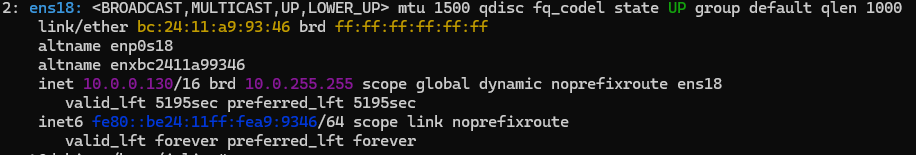
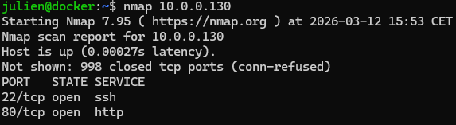
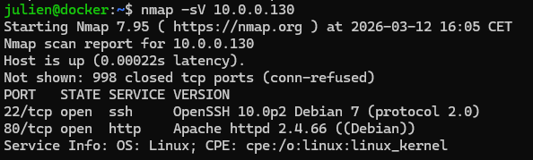
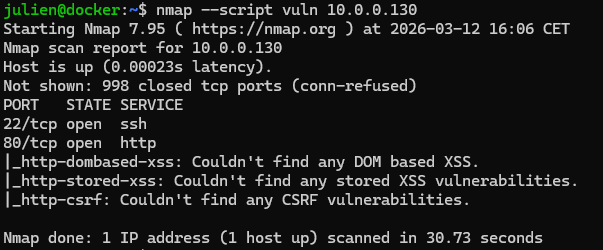
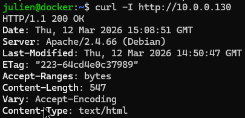
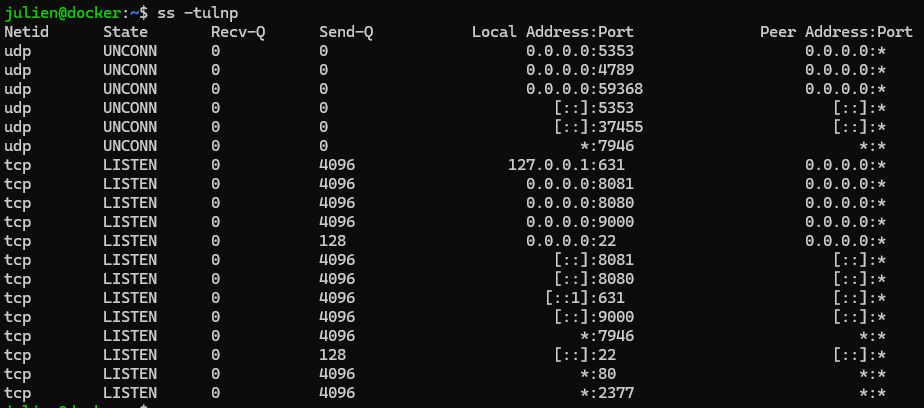
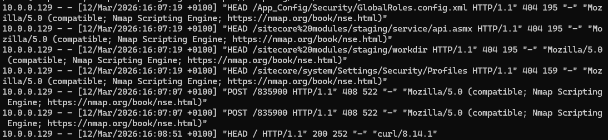

# Analyse de sécurité d’un serveur Debian exposé sur le réseau

## Présentation

Dans le cadre de cet atelier, j’ai réalisé une analyse de sécurité d’un serveur Debian accessible sur le réseau.  
L’objectif était d’observer le serveur **du point de vue d’un attaquant**, afin d’identifier les services exposés, les informations divulguées et les éventuelles vulnérabilités.

Cette approche correspond à la **phase de reconnaissance utilisée lors d’un audit de sécurité ou d’un pentest**.

---

# Identification du serveur

La première étape consiste à identifier la machine cible ainsi que sa configuration réseau.

Commande utilisée :

```bash
ip a
````



Le serveur possède l’adresse IP :

```
10.0.0.130
```

Il s’agit d’une machine virtuelle hébergée dans un environnement de virtualisation.

---

# Analyse des ports exposés

Afin d’identifier les services accessibles sur le serveur, un scan réseau a été réalisé avec l’outil **Nmap**.

Commande utilisée :

```bash
nmap 10.0.0.130
```



Résultat :

| Port | Service |
| ---- | ------- |
| 22   | SSH     |
| 80   | HTTP    |

Le serveur présente une surface d’exposition relativement limitée.

---

# Identification des services et versions

Afin d’obtenir plus d’informations sur les services détectés, un scan de version a été effectué.

Commande utilisée :

```bash
nmap -sV 10.0.0.130
```



Résultat :

| Service | Version        |
| ------- | -------------- |
| SSH     | OpenSSH 10.0p2 |
| HTTP    | Apache 2.4.66  |

Ces informations peuvent être utilisées par un attaquant pour rechercher des vulnérabilités associées aux versions des services.

---

# Recherche de vulnérabilités

Un scan de vulnérabilités a été réalisé à l’aide des scripts NSE de Nmap.

Commande utilisée :

```bash
nmap --script vuln 10.0.0.130
```



Le scan n’a pas identifié de vulnérabilités critiques sur les services exposés.

---

# Analyse du serveur web

Une requête HTTP a été envoyée afin d’identifier les informations divulguées par le serveur web.

Commande utilisée :

```bash
curl -I http://10.0.0.130
```



Le serveur retourne notamment l’information suivante :

```
Server: Apache/2.4.66 (Debian)
```

Cela constitue une **divulgation d’informations**, car la version du serveur web est visible.

---

# Vérification des services côté serveur

La commande suivante permet d’identifier les services actifs sur le serveur.

```bash
ss -tulnp
```



Cette vérification permet de comparer la configuration interne du serveur avec les résultats obtenus lors du scan réseau.

---

# Analyse des journaux

Les journaux du serveur ont été consultés afin d’identifier l’activité réseau.

Commande utilisée :

```bash
tail -n 20 /var/log/apache2/access.log
```



Les logs montrent notamment des requêtes provenant de l’outil **Nmap Scripting Engine**, ce qui confirme l’exécution d’un scan de sécurité sur le serveur.

---

# Conclusion

Cette analyse de sécurité a permis d’identifier les services exposés et les informations divulguées par le serveur.

Points positifs :

* surface d’exposition réseau limitée
* peu de ports ouverts
* services identifiés
* aucune vulnérabilité critique détectée

Points d’amélioration :

* divulgation de la version du serveur Apache
* exposition du service SSH aux attaques automatisées
* nécessité de renforcer la configuration de sécurité du serveur

Cette démarche permet de comprendre comment un serveur peut être analysé **du point de vue d’un attaquant**, ce qui constitue une étape essentielle dans un audit de sécurité.

```

