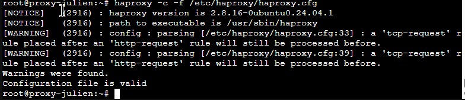
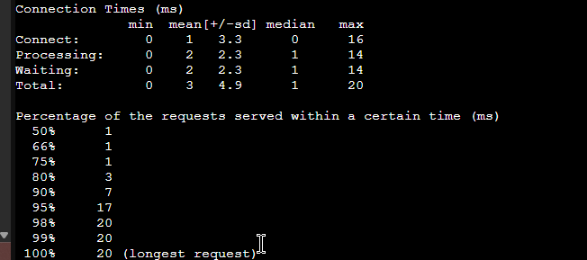
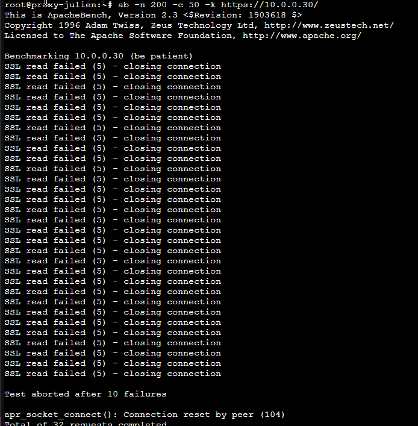
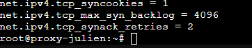
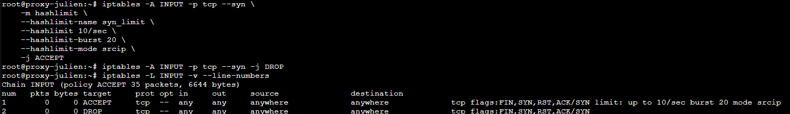
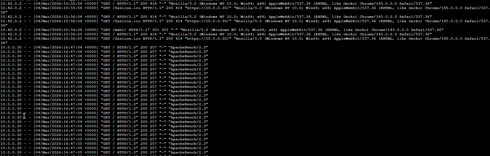

# TP — Mise en place d’un mécanisme Anti-DDoS et Rate-Limiting

## Contexte de l’infrastructure

L’infrastructure repose sur un reverse proxy HAProxy exposé en HTTPS chargé de répartir le trafic vers trois serveurs web Apache. Le proxy agit comme point d’entrée unique et permet d’implémenter des mécanismes de protection contre les attaques par saturation.

Architecture utilisée :

```

Client (10.0.0.10)
│ HTTPS
▼
Proxy HAProxy (10.0.0.30)
│ HTTP
├── web1 (10.0.0.20)
├── web2 (10.0.0.21)
└── web3 (10.0.0.22)

```

---

# 1 — Mise en place du rate-limiting avec HAProxy

J’ai commencé par sauvegarder la configuration existante de HAProxy afin de pouvoir revenir à l’état initial en cas de problème.

J’ai ensuite modifié le fichier de configuration afin d’implémenter une **stick-table**, permettant de suivre le comportement des clients en fonction de leur adresse IP.

Cette table enregistre :

- le nombre de requêtes HTTP par minute
- le nombre de connexions simultanées

Deux règles de protection ont ensuite été appliquées :

- blocage au-delà de **100 requêtes HTTP par minute**
- blocage au-delà de **20 connexions simultanées**

Lorsque ces seuils sont dépassés, HAProxy renvoie un **code HTTP 429 (Too Many Requests)**.

Avant d’appliquer la configuration, j’ai vérifié sa validité :

```

haproxy -c -f /etc/haproxy/haproxy.cfg

```

### Capture — Vérification configuration HAProxy



---

# 2 — Tests de charge

Afin de tester le comportement de l’infrastructure, j’ai installé les outils de génération de charge :

```

apt install apache2-utils siege

```

---

## Test de référence (baseline)

J’ai exécuté un premier test de charge sans mécanisme de blocage afin d’observer le comportement normal du service.

```

ab -n 200 -c 20 -k [https://10.0.0.30/](https://10.0.0.30/)

```

Toutes les requêtes ont été traitées avec succès.

### Capture — Test baseline



---

## Test avec rate-limiting

Après réactivation des règles HAProxy, j’ai exécuté un test plus agressif.

```

ab -n 200 -c 50 -k [https://10.0.0.30/](https://10.0.0.30/)

```

Ce test dépasse volontairement la limite configurée.

Le résultat montre l’apparition de **réponses HTTP 429**, indiquant que les requêtes excessives sont bloquées.

### Capture — Rate limiting actif



---

# 3 — Durcissement système contre les SYN flood

Afin de renforcer la protection contre les attaques réseau, j’ai activé les **SYN cookies** dans le noyau Linux.

```

sysctl -w net.ipv4.tcp_syncookies=1
sysctl -w net.ipv4.tcp_max_syn_backlog=4096
sysctl -w net.ipv4.tcp_synack_retries=2

```

Ces paramètres permettent d’améliorer la gestion des connexions TCP lors d’une tentative de saturation.

### Capture — Vérification SYN cookies



---

# 4 — Limitation des connexions TCP avec iptables

Pour compléter la protection réseau, j’ai ajouté une règle **iptables utilisant le module hashlimit**.

Cette règle limite les nouvelles connexions TCP à :

- **10 connexions par seconde par IP**
- burst maximum de **20 connexions**

Au-delà de ce seuil, les connexions sont rejetées.

### Capture — Règles iptables



---

# 5 — Implémentation du rate-limiting avec Nginx

Dans une seconde phase de test, j’ai remplacé HAProxy par **Nginx configuré en reverse proxy**, afin de comparer les deux approches.

Deux zones de limitation ont été définies :

- **10 requêtes par seconde** pour les accès généraux
- **1 requête par seconde** pour la route sensible `/admin`

Lorsque les limites sont dépassées, Nginx renvoie un **code HTTP 429**.

---

# 6 — Validation avec les logs Nginx

Afin d’observer les blocages en temps réel, j’ai surveillé les journaux d’accès Nginx :

```

tail -f /var/log/nginx/access.log | grep " 429 "

```

Les logs montrent l’apparition de nombreuses réponses 429 lorsque le seuil est dépassé.

### Capture — Logs de blocage Nginx



---

# Conclusion

Ce TP m’a permis de mettre en place une stratégie de protection multicouche contre les attaques de type DDoS.

Les mécanismes déployés agissent à différents niveaux :

| Couche | Protection |
|------|------|
| Système | SYN cookies |
| Pare-feu | Limitation des connexions TCP (iptables) |
| Proxy applicatif | Rate-limiting HAProxy |
| Proxy alternatif | Rate-limiting Nginx |

Cette approche permet de limiter efficacement les attaques par saturation tout en garantissant la disponibilité du service.

---

# Moyens techniques utilisés

- Linux
- HAProxy
- Apache
- Nginx
- iptables
- sysctl
- ApacheBench (ab)
- Siege
```

