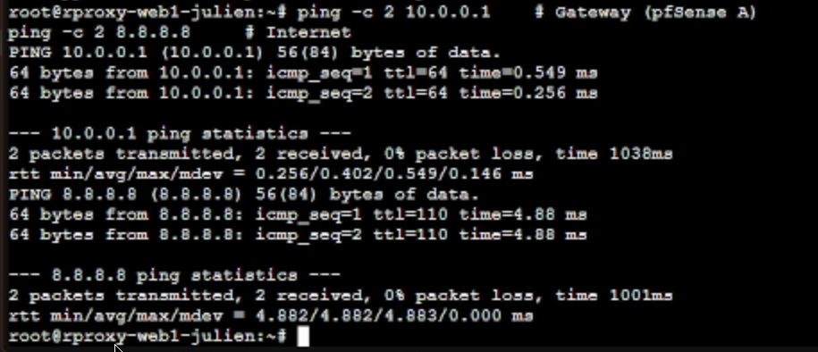
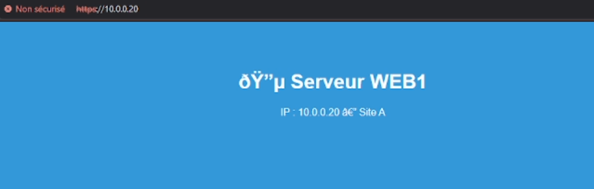
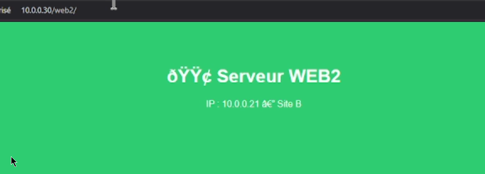
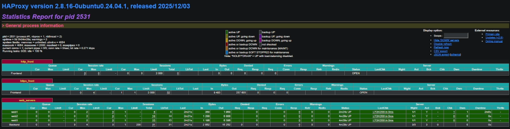
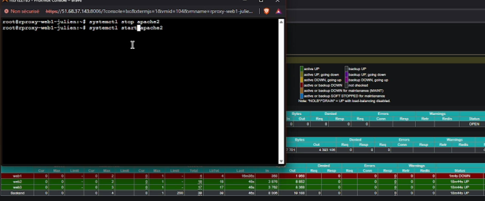

# Mise en place d’un reverse-proxy, load-balancer et HTTPS

## Contexte technique

Dans le cadre de ce TP réalisé sur mon environnement Proxmox, j’ai déployé une architecture web distribuée composée de plusieurs serveurs Apache placés derrière un reverse-proxy et un load-balancer. L’objectif était d’illustrer la terminaison TLS, la répartition de charge et la haute disponibilité.

L’infrastructure comprend :

- 3 serveurs web Apache (web1, web2, web3)
- 1 serveur proxy capable d’assurer plusieurs rôles (Nginx, Apache et HAProxy)
- 1 poste client Windows 11 permettant les tests

Tous les conteneurs sont connectés au réseau LAN A (vmbr2 — 10.0.0.0/16).

---

# 1 — Création de l’infrastructure Proxmox

J’ai commencé par déployer quatre conteneurs LXC Debian 12 dans Proxmox afin de constituer l’architecture du lab.

Chaque conteneur a été configuré avec :

- un hostname distinct
- une adresse IP statique
- une passerelle vers le firewall pfSense
- un DNS public

Une fois les conteneurs déployés, j’ai vérifié la connectivité réseau depuis chaque machine vers la passerelle et Internet.

*Création et configuration des conteneurs LXC dans Proxmox.*

---

# 2 — Déploiement des serveurs web Apache

J’ai installé le serveur web Apache sur les trois conteneurs applicatifs.

Chaque serveur héberge une page HTML distincte permettant d’identifier visuellement quel serveur répond à la requête :

- web1 : page bleue
- web2 : page verte
- web3 : page rouge

Cette différenciation visuelle permet d’observer le comportement du load-balancing.

### WEB1

*Serveur Apache web1 accessible en HTTP.*

### WEB2

*Serveur Apache web2 accessible en HTTP.*

### WEB3

*Serveur Apache web3 accessible en HTTP.*

---

# 3 — Mise en place du HTTPS sur Apache

Afin d’introduire le chiffrement TLS, j’ai généré un certificat auto-signé sur le serveur web1 et activé le module SSL d’Apache.

Après configuration du VirtualHost HTTPS, j’ai vérifié le fonctionnement depuis le navigateur.

*Avertissement de sécurité lié au certificat auto-signé.*

---

# 4 — Mise en place d’un reverse-proxy avec Nginx

J’ai installé Nginx sur le conteneur proxy afin de le configurer comme reverse-proxy.

Les requêtes sont redirigées vers les différents serveurs web selon l’URL :

- `/web1`
- `/web2`
- `/web3`

*Interface d’accueil du reverse-proxy Nginx.*

---

# 5 — Activation du HTTPS sur le reverse-proxy

Le reverse-proxy Nginx a ensuite été configuré pour supporter le HTTPS grâce à un certificat TLS auto-signé.

Le proxy assure ainsi la terminaison TLS tandis que les serveurs backend restent en HTTP.

*Reverse-proxy Nginx fonctionnant en HTTPS.*

---

# 6 — Reverse-proxy Apache (comparaison)

Afin de comparer les solutions, j’ai configuré Apache comme reverse-proxy sur le port 8443.

*Reverse-proxy Apache configuré sur le port 8443.*

---

# 7 — Mise en place du load-balancer HAProxy

J’ai ensuite déployé HAProxy afin de répartir les requêtes entre les trois serveurs web.

Le load-balancing est configuré en **Round Robin** et inclut des **health checks** pour détecter automatiquement les pannes.

*Interface de supervision HAProxy.*

---

# 8 — Tests de fonctionnement

## Test de répartition de charge

En rafraîchissant la page plusieurs fois, les réponses proviennent successivement de web1, web2 et web3.

*Rotation des serveurs backend démontrant le load-balancing.*

---

## Test de haute disponibilité

J’ai simulé la panne du serveur web2 en arrêtant le service Apache.

HAProxy détecte automatiquement l’indisponibilité et redirige le trafic vers les autres serveurs.

*Détection automatique d’un serveur indisponible par HAProxy.*

---

# Conclusion

Ce TP m’a permis de mettre en œuvre plusieurs composants essentiels d’une architecture web moderne :

- HTTPS et chiffrement TLS
- Reverse-proxy
- Terminaison TLS
- Répartition de charge
- Détection automatique des pannes
- Supervision via HAProxy

Cette architecture permet d’améliorer la sécurité, la résilience et la scalabilité d’un service web.
