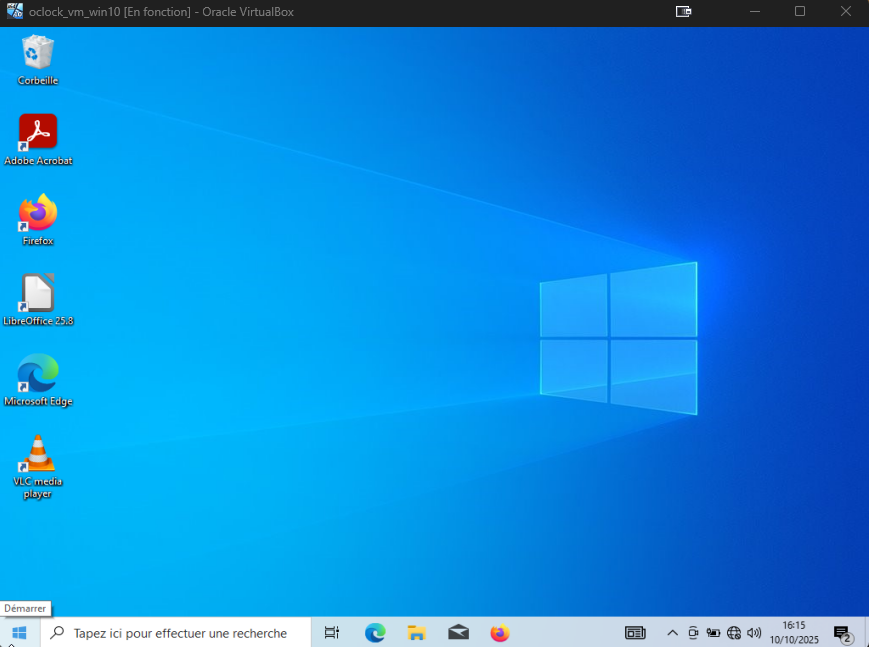
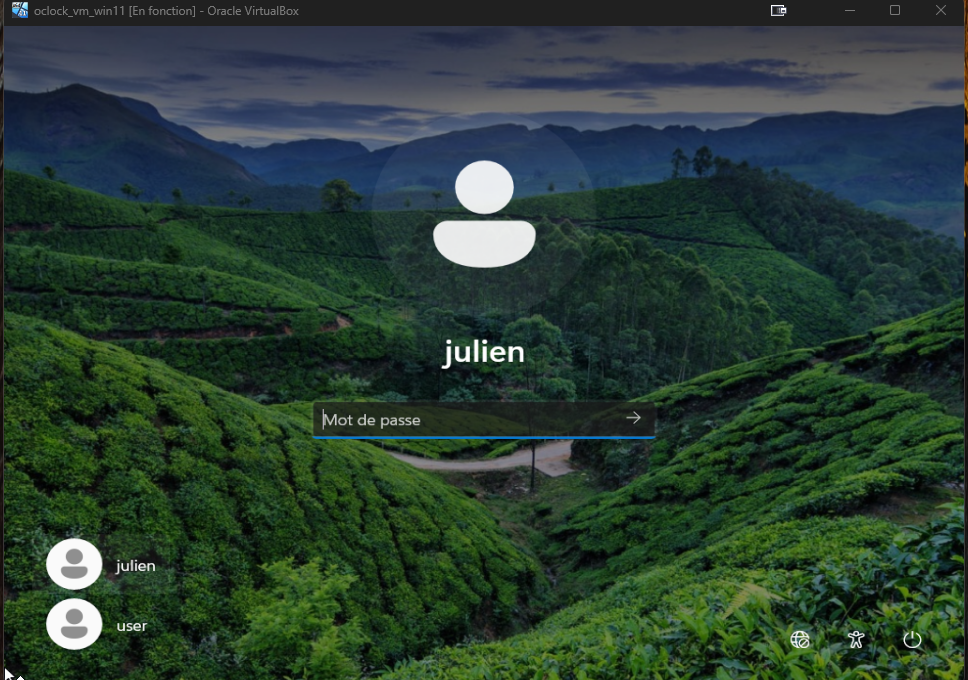
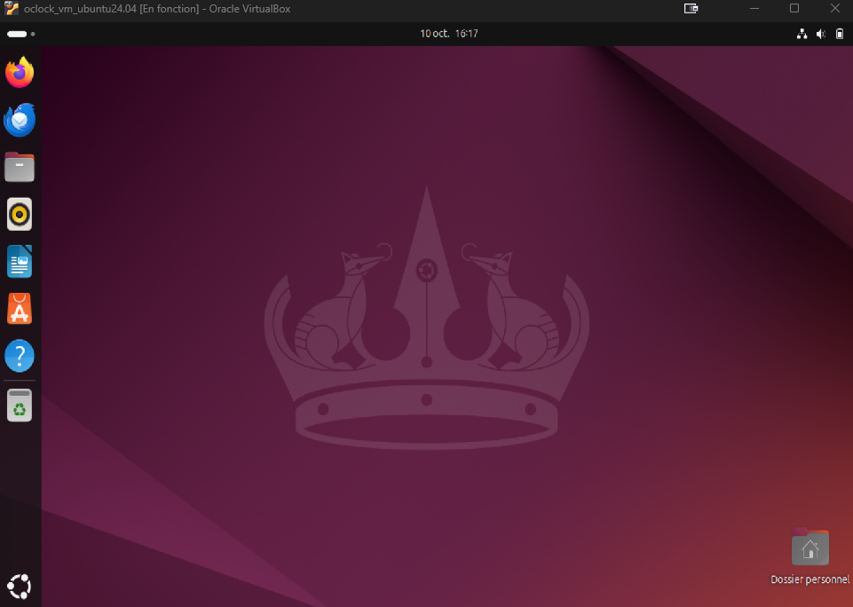

# Atelier Virtualisation – SA1

## 🎯 Objectif
Ce travail pratique avait pour but de créer et de configurer plusieurs machines virtuelles sous **VirtualBox**, afin de comprendre le fonctionnement d’un environnement virtualisé complet et de se familiariser avec les différentes étapes d’installation d’un système d’exploitation.

---

## 🧰 Environnement utilisé
- **Hyperviseur :** Oracle VirtualBox 7.x  
- **Systèmes installés :**
  - Windows 10
  - Windows 11
  - Ubuntu 24.04 LTS (desktop)
- **Ressources de la machine hôte :**  
  CPU : 8 cœurs / RAM : 16 Go / Stockage : SSD NVMe  
- **Réseaux :** NAT pour l’accès Internet, Host-Only pour les échanges inter-VM

---

## 🪟 Installation de Windows 10
- Création d’une VM avec 2 vCPU, 4 Go RAM, 40 Go de disque dynamique.  
- Installation réalisée à partir de l’ISO officielle de Windows 10.  
- Configuration d’un **compte local** sans liaison Microsoft : l’installation a été effectuée sans connexion réseau.
- Installation d’applications de test : Firefox, LibreOffice, VLC, Edge, Adobe Acrobat.



---

## 🪟 Installation de Windows 11
- Création d’une VM similaire : 2 vCPU, 4 Go RAM, 40 Go de disque.  
- Activation du TPM virtuel et du démarrage sécurisé dans VirtualBox.  
- Utilisation de la méthode `Shift + F10 → oobe\bypassnro` pour contourner la connexion obligatoire à un compte Microsoft.  
- Création de deux comptes utilisateurs : `julien` et `user`.



---

## 🐧 Installation de Ubuntu 24.04 LTS
- ISO : `ubuntu-24.04-desktop-amd64.iso`  
- Installation minimaliste avec interface GNOME.  
- Configuration : 2 vCPU, 4 Go RAM, 25 Go de disque.  
- Tests de bon fonctionnement (navigateur, terminal, outils de base).  
- L’interface réseau NAT assure l’accès Internet, le Host-Only permet les échanges locaux.



---

## 🧩 Vérifications
- Les trois systèmes démarrent sans erreur.  
- Accès Internet opérationnel sur chaque VM.  
- Sauvegarde de **snapshots** à chaque étape clé :  
  1. Installation terminée  
  2. Post-config réseau  
  3. Ajout d’outils et tests

---

## 📁 Organisation du projet
```bash
SA1-atelier-virtualisation/
├── README.md
├── captures/
│   ├── win10.png
│   ├── win11.png
│   └── ubuntu.png
└── VirtualBox-config/
    ├── VM-Win10.vbox
    ├── VM-Win11.vbox
    └── VM-Ubuntu.vbox
