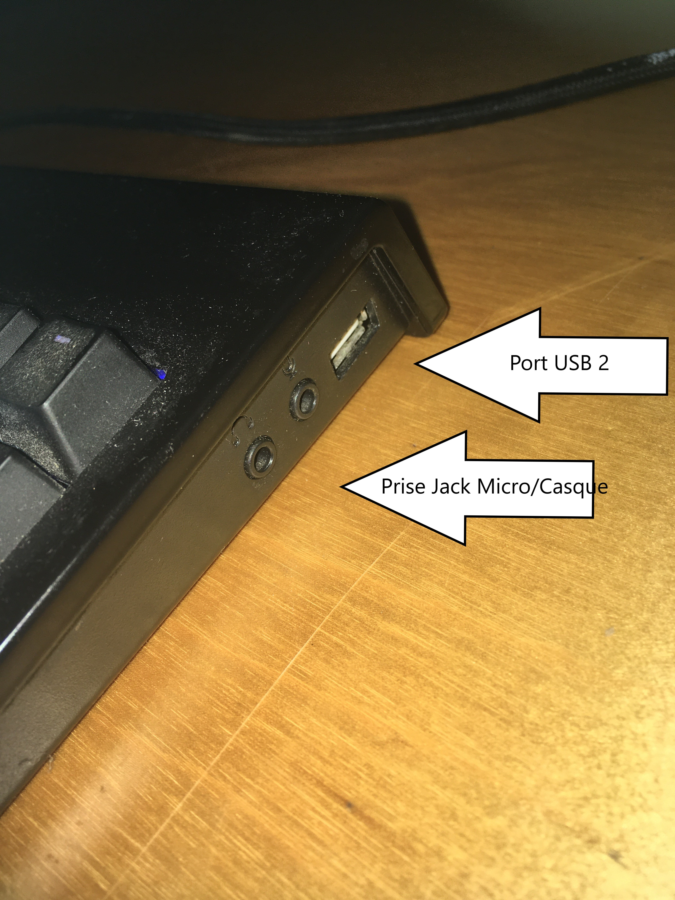
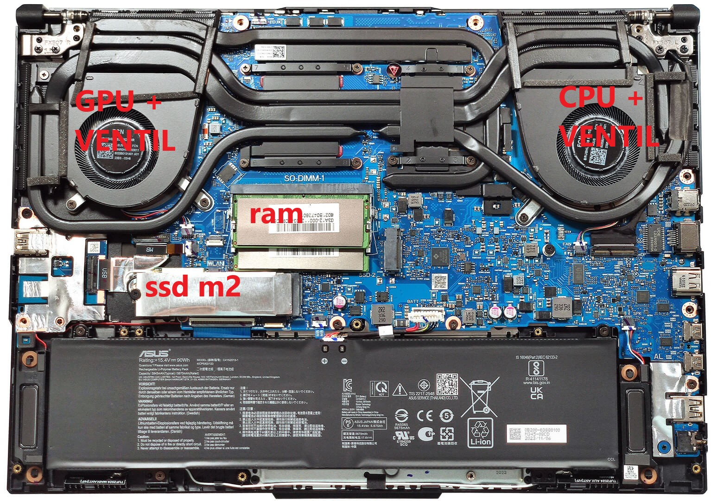

# 🧠 Exercice E03 – Connectiques et composants d’un ordinateur portable

Exercice réalisé dans le cadre de la formation **Administrateur Systèmes, Réseaux et Cybersécurité**.

Ce document présente les différents ports et composants internes d’un ordinateur portable, accompagnés de photographies et de descriptions détaillées.

---

## 🖥️ 1. Connectiques externes

### 🔌 Port USB 2.0 et prises jack audio
Permet la connexion de périphériques simples (claviers, souris, clés USB) et de dispositifs audio (microphone et casque).

  

---

### ⚡ Port USB 3.0
Transfert rapide de données pour disques externes ou périphériques haute vitesse.

  

---

### 🌐 Port RJ45 (Ethernet)
Connexion réseau filaire stable et rapide, permettant une bande passante élevée et une faible latence.

  

---

### 🧷 Ports multiples – HDMI, USB-C (USB4), USB 3.0, prise jack et alimentation
- **HDMI** : connexion d’écrans externes ou vidéoprojecteurs  
- **USB-C / USB4** : transfert haut débit, charge rapide et compatibilité avec les stations d’accueil  
- **Jack 3.5 mm** : entrée/sortie audio  
- **Alimentation** : branchement du chargeur secteur  

  

---

## ⚙️ 2. Composants internes du laptop

Sur la photo suivante, on observe les principaux éléments internes du système :

  

### Détails :
- **CPU + ventilateur** : assurent le traitement central et le refroidissement du processeur.  
- **GPU + ventilateur** : gèrent les calculs graphiques et leur dissipation the
