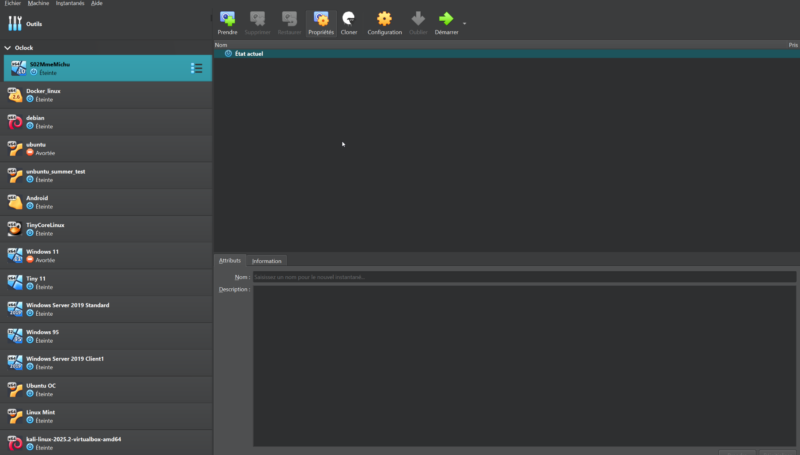
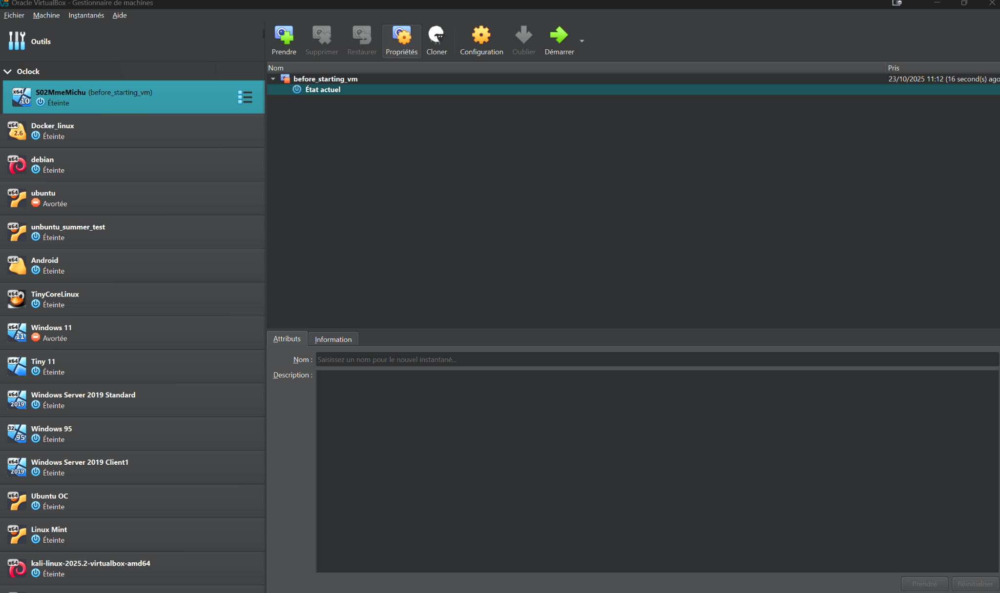
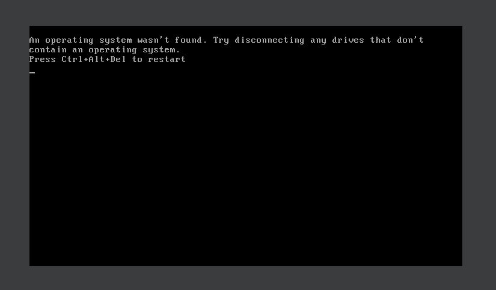
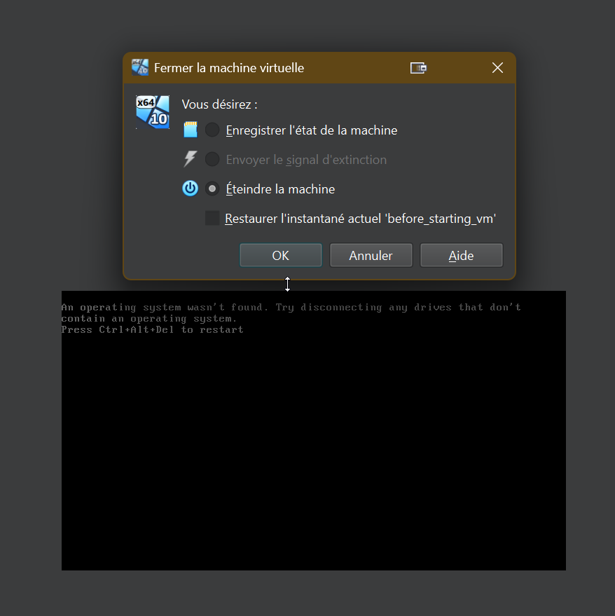
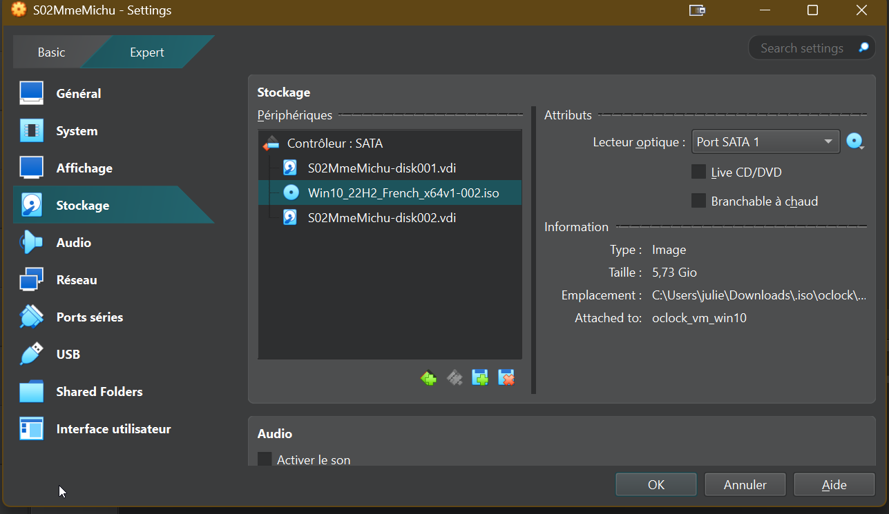
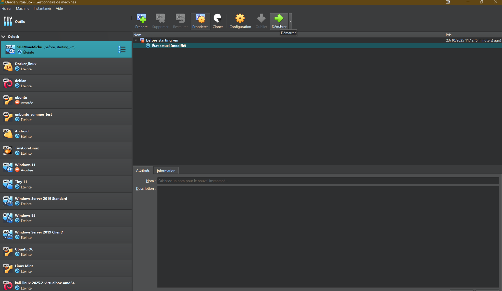
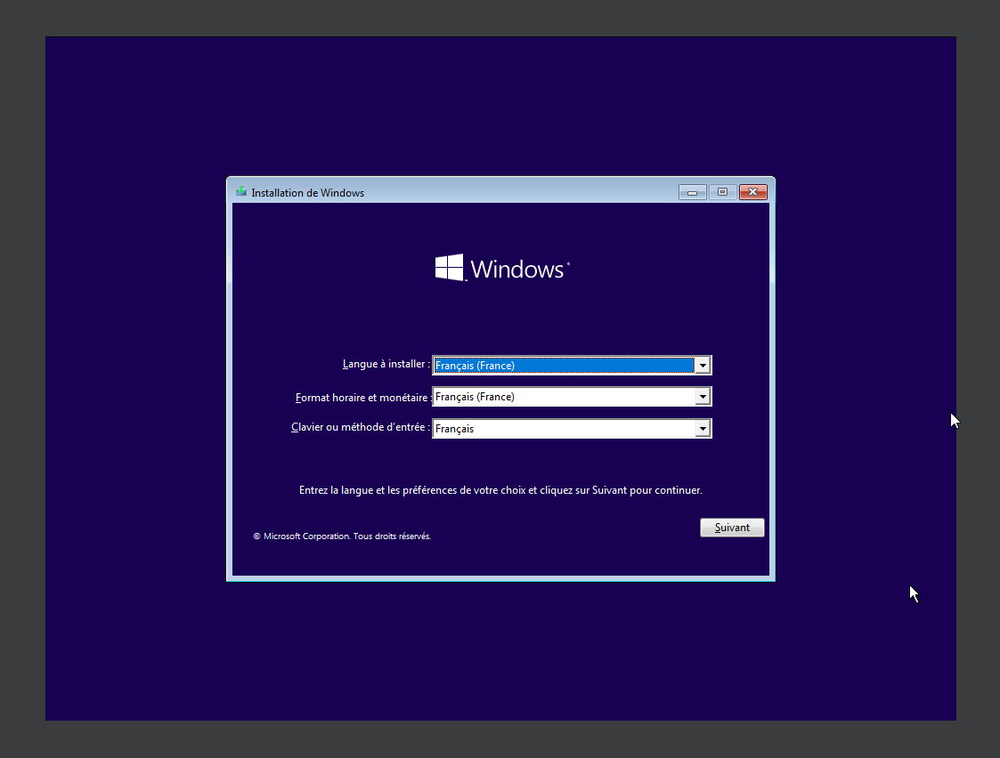
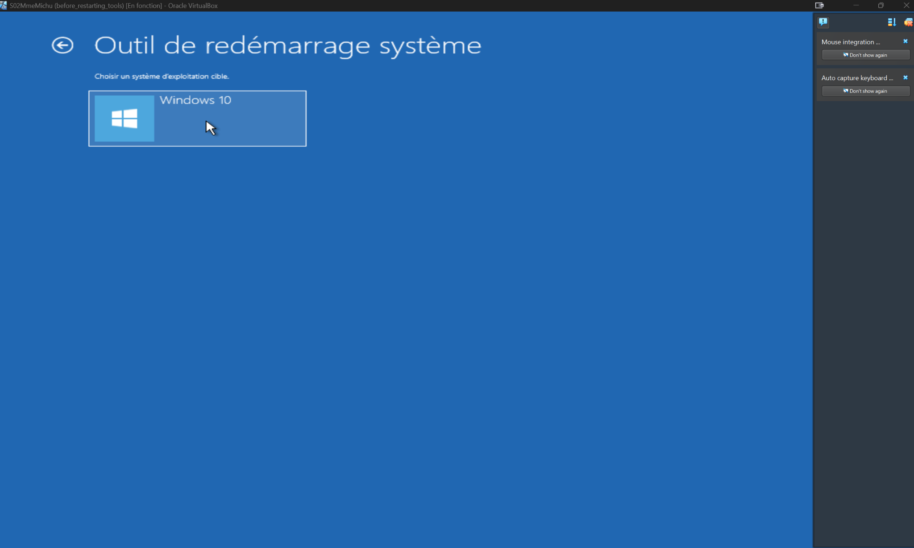

# 🧰 Étape 1 — Réparation complète du système de Mme Michu  
*Challenge : récupération et restauration du démarrage sous Windows 10 (machine virtuelle Oracle VirtualBox).*

---

## 🔹 1. Importation et préparation de la machine
  
  
  
La machine virtuelle a été importée dans VirtualBox puis protégée par un **instantané initial** avant toute modification :  


---

## 🔹 2. Erreur de démarrage et diagnostic initial
  
Le système ne démarre pas. Après plusieurs tentatives, la VM est redémarrée sur un **support ISO Windows 10** pour accéder à l’environnement de réparation.  
  
  
  
  
Choix de **"Réparer l’ordinateur"** au lieu de procéder à une installation :  


---

## 🔹 3. Accès à l’environnement de récupération
  
  
  
Exploration des partitions via **DiskPart** :  
  
Les volumes système sont identifiés :  
- `E:` → Windows  
- `C:` → Partition réservée au système  
- `F:` → Partition masquée  

---

## 🔹 4. Réparation du MBR
  
```cmd
bootrec /fixmbr

📸 Capture : 19-diskpart_sequence.png

On repère la partition contenant Windows (ici, la partition E:).

17️⃣ Vérification du contenu du disque

Avant d’agir sur le secteur de démarrage, un rapide listage permet de confirmer la présence du répertoire Windows sur le volume identifié.

E:
dir

📸 Capture : 20-to_repair.png

