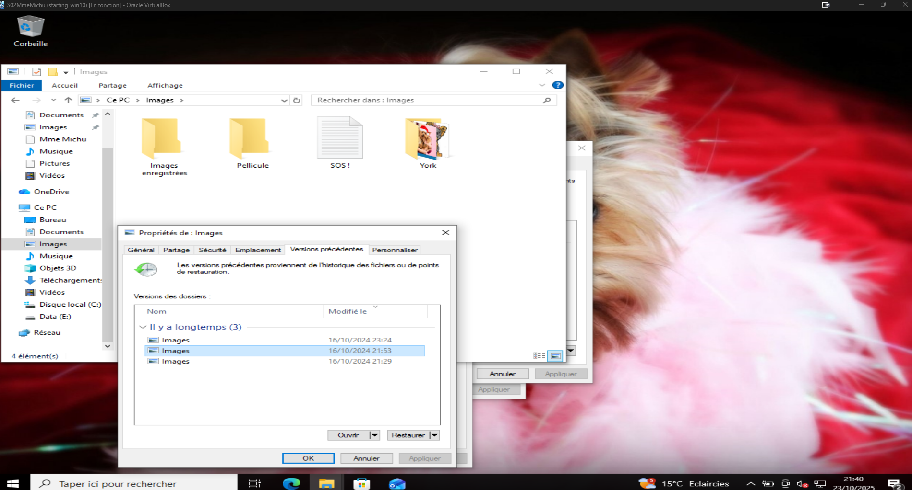
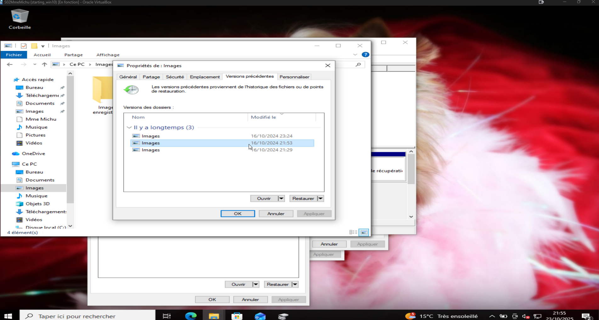

# Atelier SA2 – Remise en service de la machine de Mme Michu  
**Étape 1 : Diagnostic et tentative de réparation de la machine virtuelle**

---

## 🧩 Objectif

L’objectif de cette première étape est de diagnostiquer la panne rencontrée sur la machine virtuelle de Mme Michu et de tenter une remise en service du système sans réinstallation complète.  
Le travail a été réalisé dans un environnement **VirtualBox**, à partir d’une machine Windows corrompue au démarrage.

---

## ⚙️ Déroulement du TP

Après le téléchargement de la machine virtuelle, celle-ci est importée dans VirtualBox puis démarrée.  
Dès le lancement, le système affiche un échec au démarrage, indiquant la nécessité d’une réparation du boot.

L’assistant de récupération est ouvert via les outils de démarrage avancé.  
Plusieurs essais de réparation automatique sont effectués, sans succès.

---

## 🧰 Intervention en mode console

Un accès à la console de récupération est alors lancé.  
Les commandes de diagnostic disque sont testées :

- `diskpart` pour identifier les partitions,  
- puis `chkdsk E:` et `chkdsk C:` pour vérifier les volumes et tenter des corrections.

Les outils de réparation du secteur d’amorçage sont ensuite utilisés, via :

- `bootsect /nt60 SYS`.

Malgré ces tentatives, les réparations ne permettent pas de rétablir un démarrage complet, ce qui mène à la prise d’un nouvel instantané pour sauvegarder l’état avant redémarrage.

---

## 🖼️ Captures d’écran

Toutes les étapes sont documentées ci-dessous :

| Étape | Capture |
|:------|:--------|
| Téléchargement de la VM |  |
| Import et démarrage de la VM |  |
| Accès aux outils de réparation |  |
| Sélection du dépannage |  |
| Relance des outils système |  |
| Création d’un snapshot sécurité |  |
| Tentatives de réparation |  |
| Retour console |  |
| Séquence DiskPart |  |
| Vérifications de disque |  /  |
| Réparation du secteur de démarrage |  |
| Snapshot avant redémarrage |  |

---

## 🧾 Bilan de l’étape 1

Cette première phase a permis de comprendre la nature du problème :  
la table de démarrage et certaines partitions semblent corrompues.  
Les réparations automatiques ont échoué, mais les commandes `chkdsk` et `bootsect` ont permis de restaurer partiellement les volumes, posant les bases de la prochaine étape de restauration.

---

**Étape 2 : Optimisation et sécurisation post-réparation**

---

## 🎯 Objectif

Cette seconde étape vise à **finaliser la remise en service** de la machine virtuelle après la phase de réparation.  
Les actions portent sur l’amélioration des performances et la neutralisation des éléments suspects détectés au démarrage.

---

## ⚙️ Déroulement du TP

Une fois le système de Mme Michu à nouveau accessible, une analyse complète du poste est effectuée à l’aide d’un outil anti-malware.  
L’objectif est de s’assurer qu’aucun fichier ou processus malveillant n’interfère encore avec le système.

Constatant quelques lenteurs, la machine virtuelle est ensuite configurée pour disposer de **plus de ressources matérielles** : la mémoire vive et le nombre de cœurs CPU sont augmentés.

Afin de renforcer la stabilité au démarrage, certaines tâches PowerShell jugées inutiles ou potentiellement dangereuses sont désactivées.

Un redémarrage final permet de **vérifier le bon chargement de Windows** et de confirmer la réussite des ajustements.

---

## 🖼️ Captures d’écran

| Étape | Capture |
|:------|:--------|
| Analyse antivirus |  |
| Augmentation des ressources VM |  |
| Désactivation de PowerShell au démarrage |  |
| Avant désactivation |  |
| Vérification du démarrage final |  |

---

## 🧾 Bilan de l’étape 2

La machine de Mme Michu est désormais **fonctionnelle et stable**.  
Les vérifications de sécurité sont satisfaisantes et les performances ont été améliorées.  
Cette étape clôt la phase de dépannage et ouvre la voie à un contrôle global du système et de sa maintenance à long terme.

---

**Étape 3 : Vérification et réparation approfondie des disques**

---

## 🎯 Objectif

L’objectif de cette troisième étape est d’effectuer une **analyse complète des disques** de la machine de Mme Michu, afin de vérifier leur intégrité après les réparations précédentes et de corriger les éventuelles erreurs restantes.

---

## ⚙️ Déroulement du TP

La machine est d’abord configurée pour **reconnecter le disque secondaire (E:)**, utilisé comme support de données utilisateur.  
Une vérification du volume est immédiatement lancée via la commande `chkdsk`, afin d’évaluer son état.

L’analyse montre plusieurs secteurs endommagés, que `chkdsk` tente de corriger automatiquement.  
Une vérification supplémentaire du disque E: est effectuée directement via l’interface Oracle VirtualBox, confirmant que les opérations de réparation sont bien en cours.

Pour finaliser le processus, un **redémarrage complet de la machine** est initié, permettant à Windows d’exécuter un `chkdsk` sur la partition système C: avant le chargement du bureau.

---

## 🖼️ Captures d’écran

| Étape | Capture |
|:------|:--------|
| Connexion du disque E: |  |
| Vérification du volume |  |
| Analyse via VirtualBox |  |
| Redémarrage et vérification du disque C: |  |

---

## 🧾 Bilan de l’étape 3

Cette étape confirme la bonne intégrité du système et la stabilité du stockage.  
Les disques ont été contrôlés et réparés, garantissant un fonctionnement durable pour la machine de Mme Michu.  
La procédure s’achève avec un système sain et des volumes pleinement opérationnels.

**Étape 4 : Restauration d’une version antérieure pour récupération de données**

---

## 🎯 Objectif

Cette dernière étape vise à **récupérer un répertoire d’images perdu** en restaurant une version antérieure du dossier utilisateur.  
L’objectif est de vérifier la fiabilité du mécanisme de **récupération de versions précédentes** intégré à Windows.

---

## ⚙️ Déroulement du TP

Depuis le dossier **Images**, l’option *Versions précédentes* est ouverte dans les propriétés du répertoire.  
Trois points de restauration sont disponibles : ils correspondent à des sauvegardes automatiques créées par le système lors d’opérations antérieures.  
L’un d’eux est sélectionné pour visualiser le contenu sauvegardé, notamment le dossier **York**, contenant les images à récupérer.

La restauration est ensuite lancée depuis cette version sauvegardée, permettant de remettre en place l’ensemble des fichiers présents lors de la date choisie.  
L’opération se termine avec succès, les images réapparaissent dans le dossier initial.

---

## 🖼️ Captures d’écran

| Étape | Capture |
|:------|:--------|
| Sélection d’une version précédente |  |
| Lancement de la restauration |  |

---

## 🧾 Bilan de l’étape 4

Grâce à la restauration des versions précédentes, les fichiers perdus ont été récupérés sans recourir à un outil tiers.  
Cette étape valide la **fiabilité du système de sauvegarde Windows** et clôt avec succès la remise en service complète de la machine de Mme Michu.

---

---
