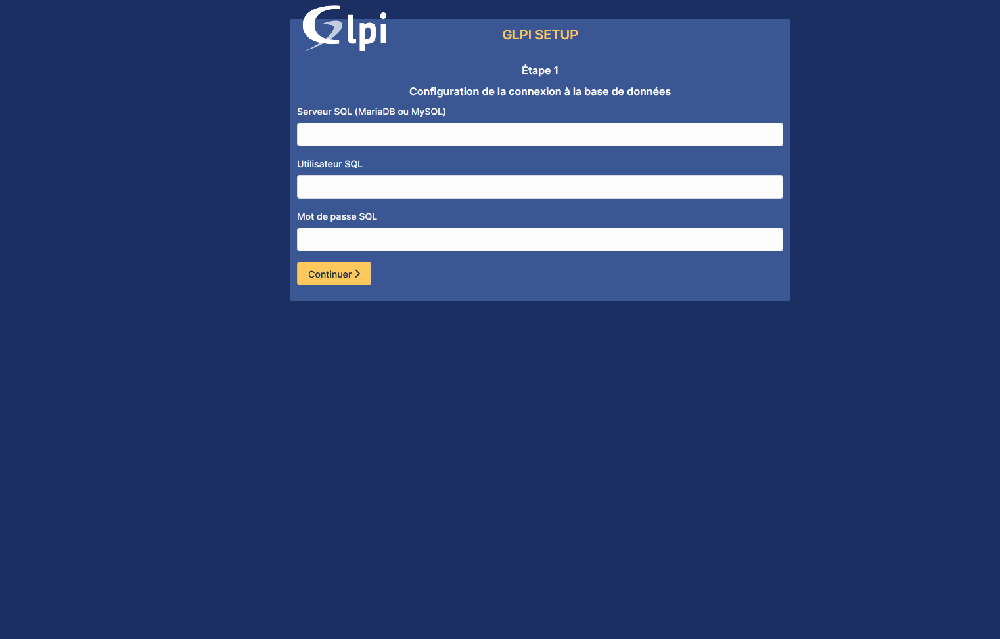
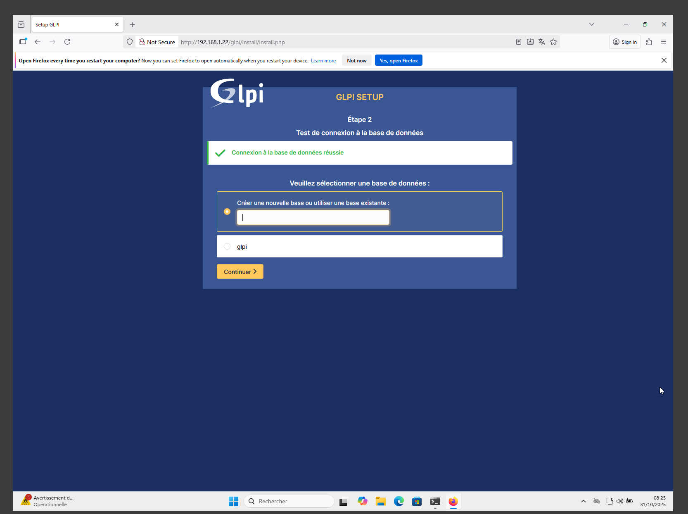
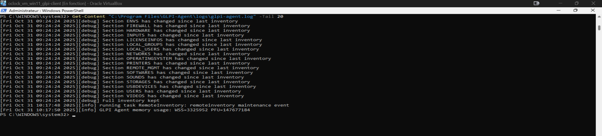
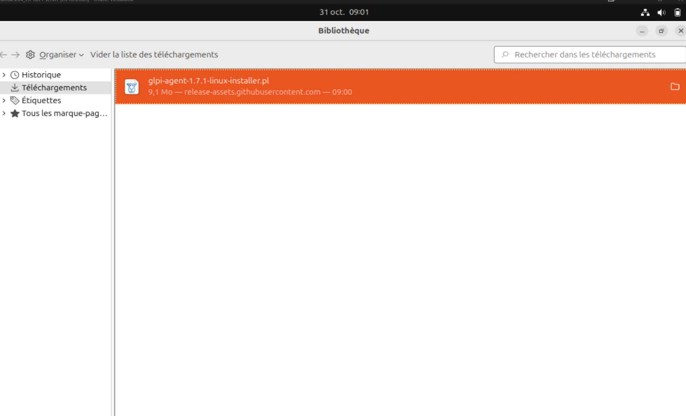

# 🧩 Intégration de GLPI Agent au serveur GLPI

*Version illustrée — environnement Linux + Windows*

---

## **1. Installation et configuration du serveur GLPI**

L’installation du serveur GLPI s’effectue sur une VM Linux (Ubuntu 24.04 dans ton cas), accessible depuis le réseau local.

**Interface d’installation de la base MySQL :**


> Le serveur SQL (`localhost`), l’utilisateur (`glpiuser`) et la base (`glpi`) sont configurés puis testés avec succès.

---

### Connexion réussie à la base de données :



> GLPI confirme la liaison avec la base et passe à l’étape de création des tables.

---

### Interface d’administration opérationnelle :


> Le tableau de bord de GLPI est maintenant accessible via :
> **[http://192.168.1.22/glpi](http://192.168.1.22/glpi)**

---

## **2. Installation de GLPI Agent sur une machine cliente (Windows)**

L’agent est téléchargé via le setup officiel (ex. *GLPI Agent 1.15 Target Setup*).
L’étape clé est la configuration du **Remote Target** :


> Dans “Remote Targets”, renseigner :
> `http://192.168.1.22/glpi`
> Cela permet à l’agent d’envoyer ses inventaires au serveur GLPI.

Une fois installé, le service **GLPI Agent** tourne en tâche de fond sous Windows.

---

## **3. Vérification du service et du log sur Windows**

Vérifie que le service fonctionne :

```powershell
Get-Service "GLPI Agent"
```

Et consulte le log :

```powershell
Get-Content "C:\Program Files\GLPI-Agent\logs\glpi-agent.log" -Tail 50
```



> On y voit le lancement du service et la communication réussie avec le serveur GLPI.

---

## **4. Installation de GLPI Agent sur le serveur Linux**

Le fichier téléchargé est :
`glpi-agent-1.7.1-linux-installer.pl`


Lancer ensuite l’installation :

```bash
cd ~/Téléchargements
chmod +x glpi-agent-1.7.1-linux-installer.pl
sudo ./glpi-agent-1.7.1-linux-installer.pl
```

---

### Durant l’installation :



> Saisir l’URL du serveur GLPI (ex. `http://127.0.0.1/glpi` si installé sur la même machine).
> Laisser vide le chemin local et valider.

---

### Vérification :

```bash
sudo systemctl status glpi-agent
```

Puis :

```bash
sudo glpi-agent --force --debug
```

> Cela force un inventaire immédiat.

---

## **5. Visualisation de l’inventaire dans GLPI**

Retour dans l’interface GLPI :


> Le poste ou le serveur équipé de l’agent apparaît automatiquement dans **Parc → Ordinateurs**.
> GLPI détecte le matériel, le système, les logiciels, et les composants réseau.

---

## **6. Conclusion**

✅ **Résultat final :**

* Le **serveur GLPI** est pleinement fonctionnel.
* Les **agents Windows et Linux** remontent correctement les informations d’inventaire.
* La synchronisation se fait automatiquement grâce au service GLPI-Agent.

